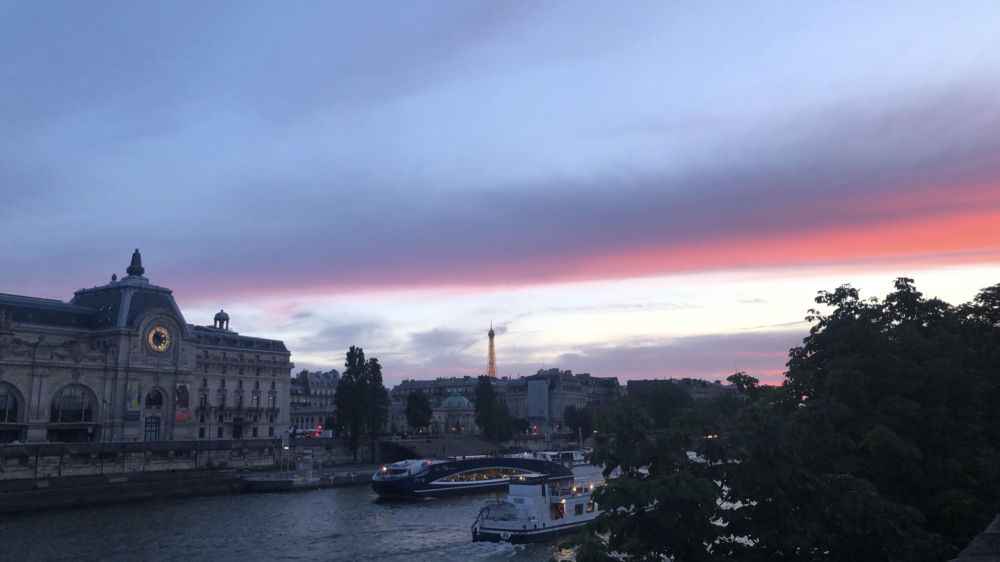

+++
# Custom widget.
# An example of using the custom widget to create your own homepage section.
# To create more sections, duplicate this file and edit the values below as desired.
widget = "custom"
active = true
date = 2020-08-09

# Note: a full width section format can be enabled by commenting out the `title` and `subtitle` with a `#`.
title = "Fun Facts"
# subtitle = "Average instructor rating: 4.8/5"

# Order that this section will appear in.
weight = 130

+++

### Running!

  
  &nbsp; &nbsp; &nbsp;
  

Running has become a big part of my life in Atlanta. I’ve connected with the local running community through the Atlanta Track Club as an ambassador, and have had a lot of fun at the various races through the year. I recently ran my first full marathon and got to explore the Silver Comet Trail while doing so! 

### Music

   
    &nbsp; &nbsp; &nbsp;
  

I play the piano and cello for fun and have been lucky to share music with others over the years — from touring with an orchestra in Portugal to performing at Carnegie Hall. In college, I also loved playing chamber music, including a memorable double-cello quintet. I also had the chance to soundcheck for Yoyo-Ma and the Silk Road Ensemble at a Gala! 

### Photography

   
  &nbsp; &nbsp; &nbsp;
   
  &nbsp; &nbsp; &nbsp;
  

I love taking photos of the places I have been able to visit. Some of my favorite destinations are pictured above: Paris, Iceland, and Hawaii. 

